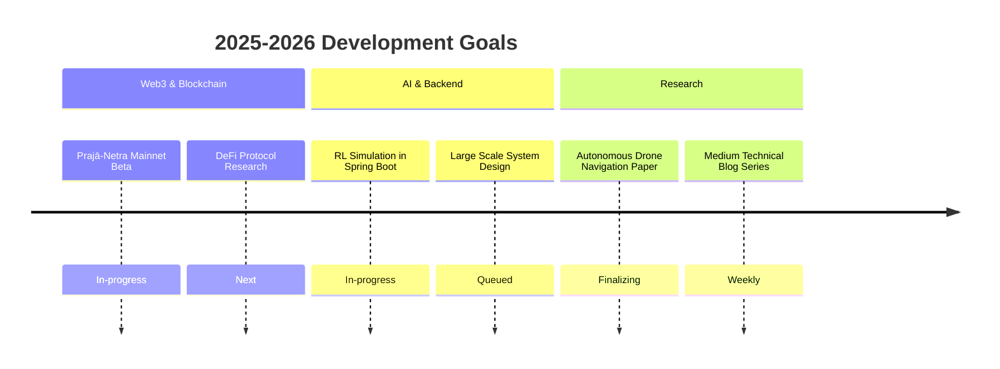

  <pre>
 ██████╗ ██████╗  █████╗      ██╗██╗    ██╗ █████╗ ██╗     
 ██╔══██╗██╔══██╗██╔══██╗     ██║██║    ██║██╔══██╗██║     
 ██████╔╝██████╔╝███████║     ██║██║ █╗ ██║███████║██║     
 ██╔═══╝ ██╔══██╗██╔══██╗██   ██║██║███╗██║██╔══██╗██║     
 ██║     ██║  ██║██║  ██║╚█████╔╝╚███╔███╔╝██║  ██║███████╗
 ╚═╝     ╚═╝  ╚═╝╚═╝  ╚═╝ ╚════╝  ╚══╝╚══╝ ╚═╝  ╚═╝╚══════╝
  </pre>

  

  

  

---

### 👨‍💻 About Me
🎓 **B.Tech Computer Science (Junior)** | Exploring the intersection of Web3 and AI.  
🚀 **Current Focus:** Building scalable backend systems with **Spring Boot** and **Blockchain** architectures.  
🏆 **Accomplishments:** SIH National Hackathon Participant | Published Researcher (2 Papers) | Technical Blogger.  
✍️ I write about tech on [Medium](https://medium.com/@prajwal.kadam2005).
---

### 🛠️ Skill Matrix

| Area                  | Technologies & Tools                                      |
| --------------------- | --------------------------------------------------------- |
| **Languages** | Java (Core & Advanced) · Python · Solidity · SQL          |
| **Backend & Web** | Spring Boot · FastAPI · REST APIs · React.js              |
| **Blockchain/Web3** | Ethereum · Smart Contracts · Decentralized Storage        |
| **AI / ML** | Deep Learning · Reinforcement Learning · OpenCV |
| **Databases / Cloud** | PostgreSQL · MongoDB · Neo4j · AWS (EC2, S3)              |
| **Tools** | Docker · Git · Linux                              |

  
  
  
  
  

---

---

### 🚀 Featured Projects

| Project | Description | Stack |
|---|---|---|
| **[Prajā-Netra](https://github.com/Prajwalkadam29/Praja-Netra)** | Corruption Complaint Management System using AI-driven verification and Blockchain for immutable logging. | Blockchain · Spring Boot · AI |
| **[Legacy Migration Engine](https://github.com/Prajwalkadam29/Legacy-Migration-Engine)** | Automated tool to convert legacy C code into modern Python using ANTLR, Neo4j graph mapping, and LLMs. | Python · ANTLR · Neo4j |
| **[AI Debate Arena](https://github.com/Prajwalkadam29/AI-Debate-Arena)** | A full-stack platform where users can debate against AI agents with NLP-based scoring. | React · FastAPI · PostgreSQL |
| **[Decentralized Verification](https://github.com/Prajwalkadam29/Certi-Verify)** | AI-powered decentralized system for secure and instant certificate verification. | Solidity · React · IPFS |

---

---
### 🧭 Roadmap

  

