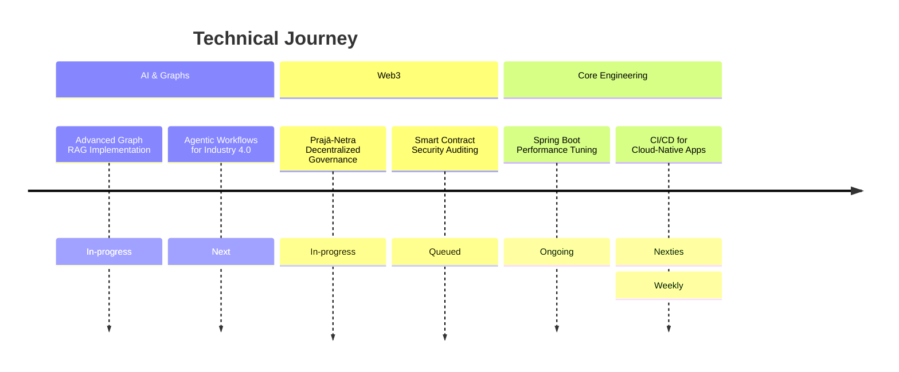

  <pre>
 ██████╗ ██████╗  █████╗      ██╗██╗    ██╗ █████╗ ██╗     
 ██╔══██╗██╔══██╗██╔══██╗     ██║██║    ██║██╔══██╗██║     
 ██████╔╝██████╔╝███████║     ██║██║ █╗ ██║███████║██║     
 ██╔═══╝ ██╔══██╗██╔══██╗██   ██║██║███╗██║██╔══██╗██║     
 ██║     ██║  ██║██║  ██║╚█████╔╝╚███╔███╔╝██║  ██║███████╗
 ╚═╝     ╚═╝  ╚═╝╚═╝  ╚═╝ ╚════╝  ╚══╝╚══╝ ╚═╝  ╚═╝╚══════╝
  </pre>

  

  

  

---

### 👨‍💻 About Me

🎓 Computer Science (AI-ML) @ Vishwakarma Institute of Technology, Pune-411037.

🚀 Building scalable backend systems with **AI**, **Python(FastAPI)**, **Java(Spring Boot)** and **Blockchain** architectures.

🏆 Published Researcher (2 Papers) | Open-source enthusiast

---

### 🛠️ Skill Matrix

| Area                  | Technologies & Tools                                      |
| --------------------- | --------------------------------------------------------- |
| **Languages** | Java (Core & Advanced) · Python · Solidity · SQL          |
| **Backend & Web** | Spring Boot · FastAPI · REST APIs · React.js              |
| **Blockchain/Web3** | Ethereum · Smart Contracts · Decentralized Storage        |
| **AI / ML** | Deep Learning · Reinforcement Learning · LangChain · Graph RAG · TensorFlowOpenCV · CrewAI  |
| **Databases / Cloud** | PostgreSQL · MongoDB · Neo4j · NebulaGraph · Weaviate · AWS (EC2, S3)      |
| **Automation** | n8n · zapier  |
| **Tools** | Docker · Git · Linux                              |

  
  
  
  
  
  
  
  
  
  
  
  

---

---

### 🚀 Featured Projects

| Project | What it does | Stack |
|---|---|---|
| **[Asset Intelligence Graph RAG](https://github.com/Prajwalkadam29/asset-intelligence-graph-rag)** | Complex asset mapping and context-aware retrieval using Knowledge Graphs. | Neo4j · LangChain · FastAPI · Python |
| **[Digital Twin Solution](https://github.com/Prajwalkadam29/Digital-Twin-Solution)** | Real-time industrial telemetry and predictive maintenance simulation. | Unity3D · MQTT · MongoDB Atlas · Python |
| **[MediProc-AI](https://github.com/Prajwalkadam29/MediProc-AI)** | Intelligent medical document processing and automated insight extraction. | Java · Spring Boot · Spring AI · Whisper · Tess4J |
| **[Decentralized Chat App](https://github.com/Prajwalkadam29/Decentralized-Chat-App)** | P2P encrypted messaging platform leveraging blockchain protocols. | Solidity · React · NodeJS · IPFS · WebRTC |
| **[Repo Doc Generator](https://github.com/Prajwalkadam29/repo-documentation-generator)** | Automated technical documentation and README generator using LLMs. | Java · Spring Boot · Spring AI · OpenAI API |

---

### 🛠 Past Projects

| Project | What it does | Stack |
|---|---|---|
| **AI Debate Arena** | Real-time debate platform (Human ↔ AI), speech-to-text, NLP scoring, leaderboards. | FastAPI · React · PostgreSQL · LLM |
| **Olist RFM** | Customer segmentation and analytics for supply chain optimization. | Pandas · Matplotlib · Data Viz |
| **Code-to-Resume** | Parser to convert YAML structured data into customized, ATS-friendly resumes. | Java · Spring Boot · Openhtmltopdf · YAML · Thymeleaf |
| **Monte-Carlo Viz** | Visualizing probabilistic outcomes and simulations for complex decision models. | Python · Matplotlib · NumPy |
| **Predictive Maintenance** | ML-based failure prediction model for hardware lifecycle management. | IoT · Python · Scikit-Learn · Pandas |

---

### 📌 Developer Impact Highlights:
- **Graph Intelligence:** Enhanced data retrieval accuracy for asset management using **Neo4j-based Knowledge Graphs**.
- **Industrial Automation:** Built a **Digital Twin** framework for real-time monitoring and failure prediction in manufacturing.
- **Workflow Efficiency:** Reduced documentation time for developers by 70% through an **AI-driven README generator**.
- **Decentralized Privacy:** Implemented **Blockchain-based chat protocols** to ensure 100% data ownership and P2P security.

---
#### Some Random Philosophical Quote

  

#### Some Random Dev Quote

  

---
### 🧭 Roadmap

---
